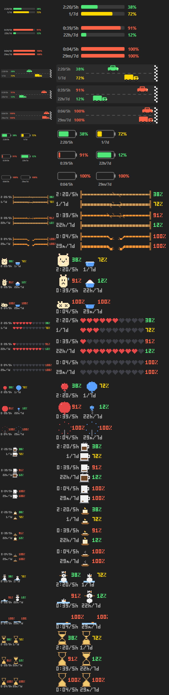

# Claude Code 사용량 작업표시줄 위젯

Claude Code 구독 한도(5시간 창 · 주간 창) 소진률을 Windows 11 **작업표시줄에 상시 표시**합니다.
PowerShell 단일 스크립트 — 설치할 것 없음.



```
2:21/5h ████████░░░░░░░░ 38%      ← 5시간 창: 리셋까지 2시간 21분, 38% 사용
   4/7d ██████████████░░ 72%      ← 주간 창: 리셋까지 4일, 72% 사용
```

## AI 에게 설치 맡기기 (가장 쉬움)

Claude Code(또는 셸을 쓸 수 있는 다른 AI 코딩 도구)에 아래를 그대로 붙여 넣으세요.

```
https://github.com/HengSsg/ai-usage-theme 의 README 를 읽고 그 절차대로 Claude Code 사용량 위젯을 설치해줘.
%USERPROFILE%\tools\cc-usage-tray 에 git clone 한 뒤 setup.ps1 을 실행하고, 끝나면 작업표시줄에 위젯이 보이는지 확인해서 알려줘.
"로그인 정보가 없습니다" 가 나오면 내가 claude 로그인을 해야 한다고 알려주고 기다려.
```

업데이트도 한 줄이면 됩니다:

```
%USERPROFILE%\tools\cc-usage-tray 의 Claude Code 사용량 위젯을 최신으로 업데이트해줘 (git pull 후 setup.ps1 재실행).
```

<details>
<summary>AI 에이전트용 실행 절차 (사람은 안 읽어도 됨)</summary>

```
# 설치 — 순서대로 실행하고 마지막 출력에 "설치 완료" 가 있는지 확인
git clone https://github.com/HengSsg/ai-usage-theme.git "%USERPROFILE%\tools\cc-usage-tray"
powershell -NoProfile -ExecutionPolicy Bypass -File "%USERPROFILE%\tools\cc-usage-tray\setup.ps1"

# 출력이 "Claude Code 로그인 정보가 없습니다" 면: 사용자에게 `claude` 실행 후 구독 계정 로그인을 요청하고, 로그인 뒤 setup.ps1 만 다시 실행
# 이미 폴더가 있으면(재설치·업데이트): git -C "%USERPROFILE%\tools\cc-usage-tray" pull --ff-only  →  setup.ps1 재실행
# 확인: 작업표시줄 왼쪽(아이콘 가운데 정렬) 또는 트레이 앞(아이콘 왼쪽 정렬)에 "H:MM/5h … N/7d …" 위젯. 프로세스: powershell.exe (usage-tray.ps1)
# 제거: powershell -NoProfile -ExecutionPolicy Bypass -File "%USERPROFILE%\tools\cc-usage-tray\setup.ps1" -Uninstall
```

전제: Windows 11 · Claude Code 구독(Pro/Max/Team) OAuth 로그인 · git. 그 외 설치 없음. 네트워크 접근은 `api.anthropic.com`(사용량) 과 `github.com`(설치/업데이트) 둘뿐.
</details>

## 요구사항

- Windows 11 (작업표시줄 48px 기준, 배율 100%에서 확인됨) · PowerShell 5.1 (기본 내장)
- **Claude Code 로그인 상태** — `%USERPROFILE%\.claude\.credentials.json` 이 있어야 합니다.
  구독(Pro/Max/Team) OAuth 로그인만 지원 — API 키 로그인엔 사용량 API 가 없습니다.

## 설치 / 제거

1. 받기 — 둘 중 하나:
   ```
   git clone https://github.com/HengSsg/ai-usage-theme.git %USERPROFILE%\tools\cc-usage-tray
   ```
   또는 GitHub 에서 **Code → Download ZIP** 을 풀어 원하는 위치에 둡니다. (git clone 이면 나중에 `git pull` 로 업데이트)
2. **`install.cmd` 더블클릭** → 시작프로그램 등록 + 즉시 실행
3. 제거: **`uninstall.cmd`** (위젯 종료 · 시작프로그램 해제 · 개인 설정 삭제)

폴더를 옮기면 시작프로그램 링크가 끊어집니다 — 옮긴 뒤 `install.cmd` 를 다시 실행하세요.

## 사용

위젯에서 **우클릭**:

| 메뉴 | 내용 |
|---|---|
| 테마 | 12종 — 아래 「테마」 표 |
| 위치 | 자동(아이콘 가운데 정렬이면 왼쪽, 왼쪽 정렬이면 트레이 앞) · 왼쪽 · 오른쪽 |
| 지금 새로고침 | 즉시 재조회 |
| 업데이트 확인 | GitHub 최신 버전 확인 → 있으면 설치 후 자동 재시작 (아래 「업데이트」) |
| 종료 | 위젯 종료 (다음 로그인 때 다시 뜸 — 완전 제거는 uninstall.cmd) |

마우스를 올리면 리셋까지 남은 시간이 툴팁으로 나옵니다.

- 라벨: `2:21/5h` = 5시간 창 리셋까지 2시간 21분 · `4/7d` = 주간 창 리셋까지 4일 (24시간 미만이면 `23h/7d`)
- 색: 사용률 60% 미만 초록 · 85% 미만 노랑 · 그 이상 빨강
- 표시 문구: `CC 잠시 후 재시도` = API 429(자동 회복) · `CC 재로그인 필요` = 토큰 만료(`claude` 실행해 로그인) · `CC 조회 실패` = 네트워크/프록시(툴팁에 원문)

## 테마

앞의 셋은 벡터, 나머지는 **2px 도트 픽셀아트**(48px = 24행). 5h·7d 두 지표를 각 테마가 어떻게 나누는지:

| # | 테마 | 표현 | 5h / 7d |
|---|---|---|---|
| 01 | 막대 게이지 (기본) | 진행 막대 + 숫자 | 두 줄 |
| 02 | 자동차 | 결승 깃발까지 달리는 차, 왼쪽에 남은시간·% | 승용차 / 화물차 |
| 03 | 배터리 | 잔량 = 남은 한도 | 두 개 |
| 04 | 밧줄 | 쓸수록 너덜너덜 → 75% 한 가닥 → **100% 뚝** | 가는 줄 / 굵은 줄 |
| 05 | 배부름 | 배 크기·표정 = 5h 남은 양, 밥그릇 = 7d 남은 양. 100% 쓰면 기절 x_x | 캐릭터 / 밥그릇 |
| 06 | 하트 HP | 하트 10개, 10% 마다 하나씩 비어감 | 두 줄 |
| 07 | 풍선 | 쓸수록 부풀어 **100% 펑** | 빨강 / 파랑 |
| 09 | 커피 | 잔 속 커피 = 남은 양, 가득하면 김 | 위 작은 잔 / 아래 머그 |
| 10 | 양초 | 남은 만큼 초, 불꽃 깜빡, 다 타면 연기 | 위 5h / 아래 7d |
| 11 | 눈사람 | 녹아서 웅덩이, 100% 면 모자·당근만 | 두 눈사람 |
| 12 | 모래시계 | 위 모래 = 남은 양, 목에서 떨어지는 모래 | 두 개 |

번호는 메뉴 정렬 순서일 뿐입니다(08 은 세로 은유가 48px 가로 위젯에 안 맞아 뺀 젠가 자리).

> **테마 레이아웃 요령** — 48px 안에 아이콘·%·라벨을 한 칸에 몰아넣으면 뭉쳐서 안 읽힙니다.
> `라벨(오른쪽 정렬) | 아이콘 | %` 를 **열로 맞춘 2행**(5h 위 / 7d 아래)이 가장 잘 읽힙니다 — 막대·밧줄·하트·커피·양초가 이 구조.
> 세로로 차오르는 게이지는 해상도가 낮으니(6~8단) 정확한 값은 옆의 숫자에 맡기고, 그림은 "대충 얼마나 남았나" 만 전하게 두세요.
깜빡임(불꽃·김·떨어지는 모래)은 분 단위로 바뀝니다 — 위젯이 매 분 다시 그리는 타이밍에 맞춘 것.
라이트 테마 작업표시줄에서는 글자·게이지 색이 자동으로 어두운 쪽으로 바뀝니다.

## 업데이트

테마가 추가되거나 수정이 올라오면 위젯이 알려주고 스스로 갈아탑니다.

- **자동 점검**: 시작 20초 뒤 1회, 이후 하루 1회 GitHub 를 확인합니다. 새 버전이 있으면 위젯 **우상단에 노란 점**이 뜨고 툴팁·메뉴에 "새 버전 있음" 이 표시됩니다. 설치는 자동으로 하지 않습니다.
- **설치**: 우클릭 → **업데이트 설치** → 확인 → 받아서 덮어쓰고 **자동 재시작**. `config.json`(테마·위치)·`last.json` 은 유지됩니다.
- 방식은 설치 형태에 따라 자동 선택: `git clone` 이면 `git pull --ff-only`, ZIP 설치면 GitHub `main.zip` 을 다시 받아 덮어쓰기(현재 버전은 `version.txt` 로 추적).
- 수동으로 하려면 `git pull` 후 `install.cmd`(재시작 포함).

## 동작 원리

- Claude Code 의 `/usage` 가 쓰는 `GET https://api.anthropic.com/api/oauth/usage` 를 **120초마다** 조회합니다.
  비공개 엔드포인트라 Anthropic 이 바꾸면 깨질 수 있습니다. 토큰은 매번 `.credentials.json` 에서 읽어 Claude Code 의 토큰 갱신을 그대로 따라갑니다(별도 갱신 로직 없음).
- Windows 11 은 작업표시줄에 위젯을 꽂는 공식 API 가 없어 **작업표시줄 위에 TOPMOST 창**을 얹습니다. 2초마다 위치·z순서를 재확인하고, 배경색은 작업표시줄 픽셀을 샘플링해 라이트/다크 테마에 맞춥니다. 작업표시줄이 자동 숨김이면 위젯도 같이 숨습니다.
- 네트워크 호출은 전부 **비동기**입니다. UI 스레드에서 응답을 기다리면 메시지 루프가 멈춰 Windows 가 "응답 없음" 으로 프로세스를 죽입니다(초기 버전이 이 문제로 가끔 사라졌습니다). 지금은 요청을 던져 두고 1초 틱이 완료 여부만 확인합니다.
- 429 방지: 단일 인스턴스(뮤텍스) · 마지막 응답 캐시 `last.json`(재시작 직후 재호출 안 함) · 실패 시 폴링 간격 2배(최대 10분).
- 오류는 조용히 삼키지 않고 `error.log` 에 남습니다(20KB 넘으면 자동으로 잘림). 위젯이 사라지거나 이상하면 먼저 이 파일을 보세요.

## 테마 추가

`themes\NN-이름.ps1` 파일이 아래 해시테이블을 **마지막 표현식으로 반환**하면 메뉴에 자동 등록됩니다(두 자리 숫자 접두 = 메뉴 순서).

```powershell
@{
    Id = 'myTheme'; Name = '내 테마'; Width = 200      # Width 는 int 또는 { param($d) ... }
    Draw = {
        param($g, $d, $w, $h)                          # $g = System.Drawing.Graphics, 캔버스 $w x $h
        Draw-Text $g $d.L5 11 $true $Col.Label 8 15    # 5h 라벨(예: 2:21/5h)
        Fill-RoundRect $g $d.C5 40 11 100 9 2          # $d.S5 = 5h 사용률(%), $d.C5 = 그 색
    }
}
```

`$d`: `S5` `S7`(사용률 %) · `C5` `C7` `CD`(색, CD 는 둘 중 높은 쪽) · `L5` `L7`(남은시간/창 라벨) · `R5` `R7`(리셋 문구).
헬퍼: `Draw-Text`(세로중심 기준) · `Fill-RoundRect` · `Draw-RoundRect` · `Fill-Circle` · `Measure-Text` · `$Col`(Green/Gold/Red/Track/Label/Dim/Light/Road) · `Get-LevelColor`.

**픽셀아트 테마**는 `Use-PixelMode $g` 로 시작하고 셀(2px) 단위 헬퍼를 씁니다 — 캔버스는 24행 × (폭/2)열:

```powershell
Use-PixelMode $g                                  # 안티앨리어싱 off
Px-Fill $g $Px.Cream 3 5 10 4                     # (x, y, 폭, 높이) 셀 단위
Px-Circle $g $Px.White 9 14 3                     # (cx, cy, r)
Draw-Sprite $g @('.##.', '####', '.##.') 2 2 @{ '#' = $Px.Red }   # 문자열 = 한 행, 글자 → 색, '.' 투명
Draw-PixelText $g $d.L5 0 18 $Col.Label           # 3x5 픽셀 폰트 (숫자 : / % h d m)
```

`$Px` 팔레트: Ink White Gray Dark Red Pink Orange Yellow Green Blue Sky Brown Wood Cream Sand Coffee. 분마다 바뀌는 효과는 `(Get-Date).Minute % 2` 로.

확인은 API 호출 없이:

```
powershell -ExecutionPolicy Bypass -File usage-tray.ps1 -RenderTest out.png
```

모든 테마를 두 가지 표본 데이터로 1x·2x 렌더한 PNG 한 장이 나옵니다.

## 알려진 한계

- 전체화면 앱(게임·영상) 위에도 표시됨
- 세로(좌/우) 작업표시줄에서는 가로 레이아웃이 맞지 않아 위젯을 숨김
- 배율 100% 외에선 미검증

## 파일

| 파일 | 역할 |
|---|---|
| `usage-tray.ps1` | 본체 |
| `themes\*.ps1` | 테마 플러그인 |
| `setup.ps1` · `install.cmd` · `uninstall.cmd` | 설치/제거 |
| `config.json` · `last.json` · `version.txt` | 개인 설정·캐시·설치본 버전 (자동 생성, 공유 불필요) |
| `design\` | 테마 목업 생성기(선택) |

## 라이선스

[MIT](LICENSE)
